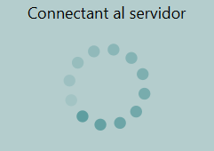
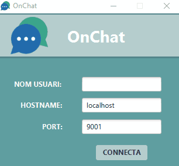
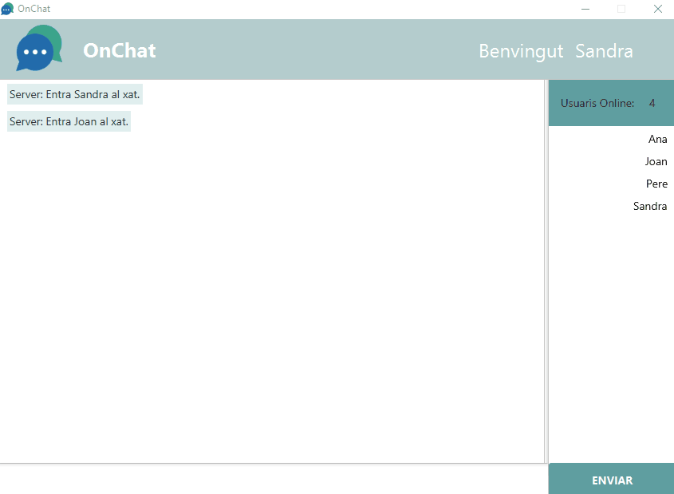

## OnChat
OnChat és una aplicació desenvolupada amb fins acadèmics, per demostrar la utilitat dels sockets en un entorn de desenvolupament real.

El projecte consisteix en implementar en JAVA una aplicació basada en sockets per poder jugar al Trivial-mIRC. L'aplicació consta d'una part servidor, que fa de màster i gestor de la partida, i tants clients com es vulguin afegir. Les preguntes s'agafen d'un fitxer de text pla, en format csv.

Implementant les següents millores:
* Categories a les preguntes. Es poden afegir tants fitxers com es desitgi.
* Interfície gràfica, desenvolupada amb JavaFx.
* Animacions i sons.

 

## Prerequisits
És necessari tenir instal·lats els següents components a l'ordinador per a poder executar el projecte:

* [JDK SE 1.8](http://www.oracle.com/technetwork/java/javase/downloads/jdk8-downloads-2133151.html)
* [Eclipse amb e(fx)clipse plugin](http://www.eclipse.org/efxclipse/install.html)
* [Java FX SceneBuilder 2.0](http://www.oracle.com/technetwork/java/javafxscenebuilder-1x-archive-2199384.html)

## Importar el projecte
##### Importar el projecte a Eclipse
1. Clicar a <b>File</b> -> <b>Import...</b>
2. Selecciona a <b>General</b> -> <b>Existing Projects into Workspace</b>
3. Especifica el directori on has guardat la carpeta del projecte.
4. Selecciona tots els subdirectoris del projecte.
5. Clicar <b>Finish</b>

## Executar l'aplicació
Per tal d'executar aquesta aplicació al teu ordinador serà necessari realitzar les següents passes:

##### Executar el Servidor d'OnChat
1. Obrir el mòdul mIRC-server, clicar amb el botó dret del ratolí sobre l'arxiu `MainServer.java` -> <b>Run As</b> -> <b>Java Application</b>
2. Un cop connectat el servidor, la finestra de càrrega es tancará automàticament.

##### Connectant al xat
1. Obrir el mòdul mIRC-client, clicar amb el botó dret del ratolí sobre l'arxiu `Main.java` -> <b>Run As</b> -> <b>Java Application</b>
2. Indica un nom d'usuari per a utilitzar al xat.
3. No modifiquis els camps `localhost` i `port`, la connexió al servidor és realitza amb les dades que hi ha indicades.
4. Clica <b>CONNECTA</b> per accedir a la sala del xat.

